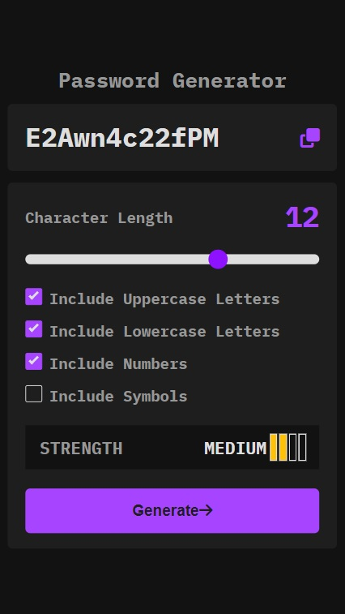
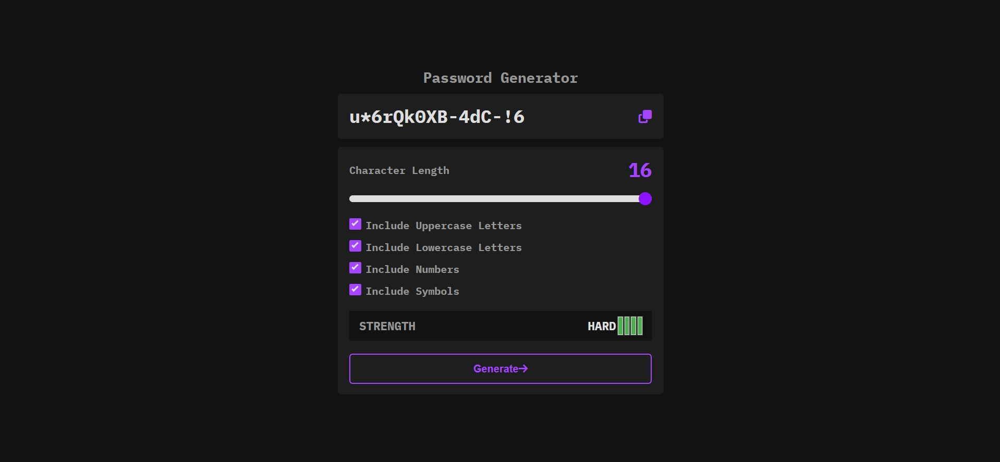

# Password Generator

## Table of contents
* [General info](#general-info)
* [Technologies](#technologies)
* [Screenshots](#screenshots)

## General info
This application helps you easly generate password. You only need to choose its length from 4 to 16 characters and include what you want - lowercase letters, uppercase letters, numbers and/or symbols. Before you generate your password, you are able to see its strengh. After generating you can copy password by one click. 

## Technologies
* HTML5
* CSS3
* Sass
* JavaScript
* Webpack

## Screenshots

